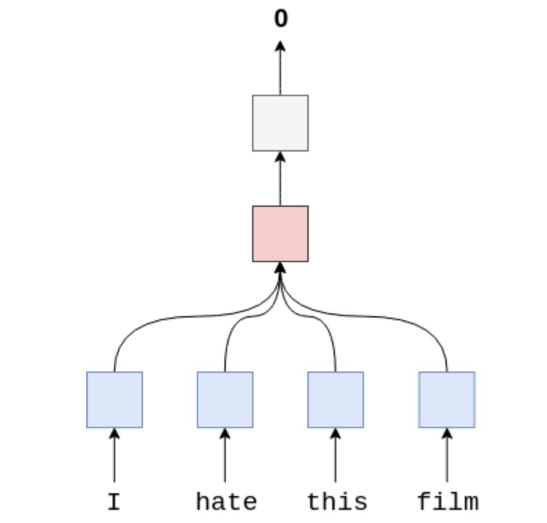
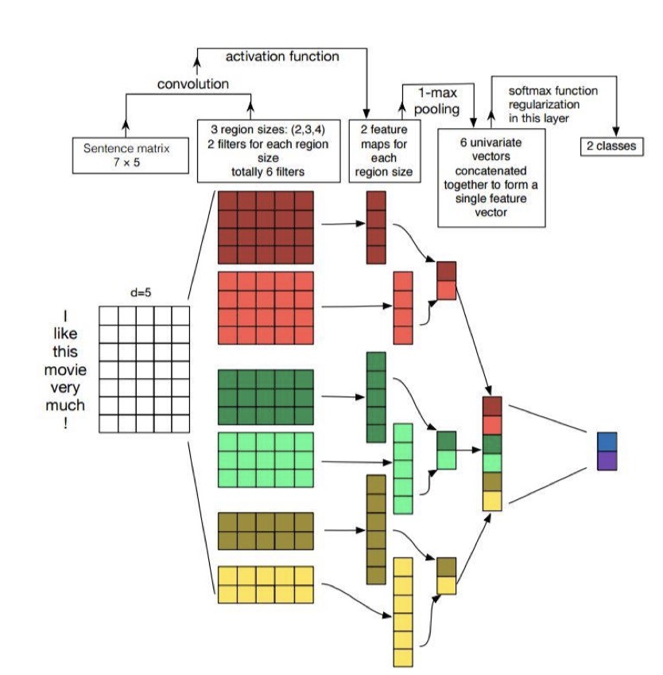

# 文本分类
### 步骤：
1. 定义样本的处理操作。—> torchtext.data.Field
2. 加载 corpus （都是 string）—> torchtext.data.Datasets
    1. 在Datasets 中，torchtext 将 corpus 处理成一个个的 torchtext.data.Example 实例
    2. 创建 torchtext.data.Example 的时候，会调用 field.preprocess 方法
3. 创建词汇表， 用来将 string token 转成 index —> field.build_vocab()
    1. 词汇表负责：string token ---> index, index ---> string token ，string token ---> word vector
4. 将处理后的数据 进行 batch 操作。—> torchtext.data.Iterator
    1. 将 Datasets 中的数据 batch 化
    2. 其中会包含一些 pad 操作，保证一个 batch 中的 example 长度一致
    3. 在这里将 string token 转化成index。

## 环境配置

## 文件说明

## 数据集

* [toutiao_cat_data.txt](data/toutiao_cat_data.txt) 新闻短文本分类数据集，38万条数据，15个分类，详见[这里](https://github.com/fatecbf/toutiao-text-classfication-dataset)
* [weibo_senti_100k.csv](data/weibo_senti_100k.csv) 带情感标注新浪微博，10万条数据，2个分类，正向负向约各5万，详见[这里](https://github.com/SophonPlus/ChineseNlpCorpus/blob/master/datasets/weibo_senti_100k/intro.ipynb)
* [ChnSentiCorp_htl_all.csv](data/ChnSentiCorp_htl_all.csv) 酒店评论数据，7000条数据，2个分类，正向5000多，负向2000多，详见[这里](https://github.com/SophonPlus/ChineseNlpCorpus/blob/master/datasets/ChnSentiCorp_htl_all/intro.ipynb)
*（以上数据集来自[ChineseNLPCorpus](https://github.com/InsaneLife/ChineseNLPCorpus)）*

* [cnews](/data/cnews/*) 新闻数据，使用THUCNews的一个子集。训练使用了其中的10个分类，每个分类6500条数据。类别：体育, 财经, 房产, 家居, 教育, 科技, 时尚, 时政, 游戏, 娱乐

## 预训练词向量
* [中文词向量](https://github.com/Embedding/Chinese-Word-Vectors)：有各种预训练的中文词向量

## 传统机器学习方法

## 深度学习方法
### RNN
优化器：adam or sgd
学习率：1e-3
结果：
Epoch: 10 | Epoch Time: 0m 9s
	Train Loss: 0.697 | Train Acc: 50.18%
	 Val. Loss: 0.697 |  Val. Acc: 49.14%
Test Loss: 0.693 | Test Acc: 50.03%

### LSTM
因为rnn存在梯度弥散的问题，LSTM通过增加一个循环状态memery，使用门来控制memery的进出，可以克服这个问题

### fastText

与LSTM相比模型参数相差不大，但是fastText速度更快，是LSTM的1/6。效果略低于lstm
Epoch: 05 | Epoch Time: 0m 10s
	Train Loss: 0.082 | Train Acc: 97.83%
	 Val. Loss: 0.170 |  Val. Acc: 95.21%
Test Loss: 0.171 | Test Acc: 95.49%
### TextCNN

#### 注意：句子的最大 大小 不能小于 所有卷积核中宽度最大的卷积核宽度

### bi-rnn

### Multi-layer RNN(deep-rnn)

## 参考
